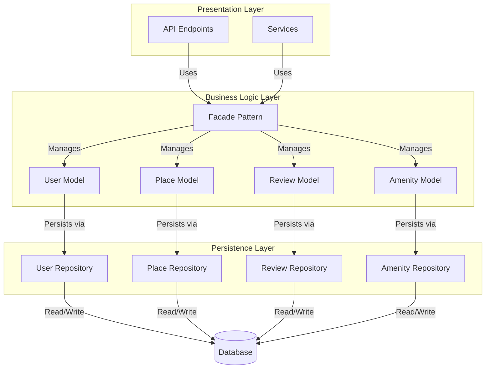
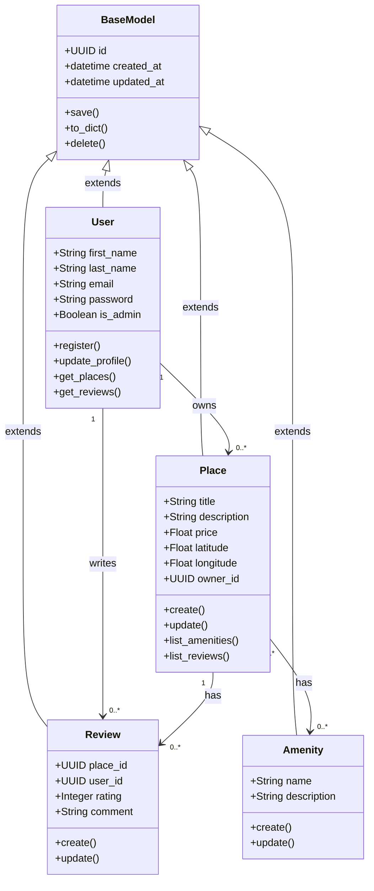
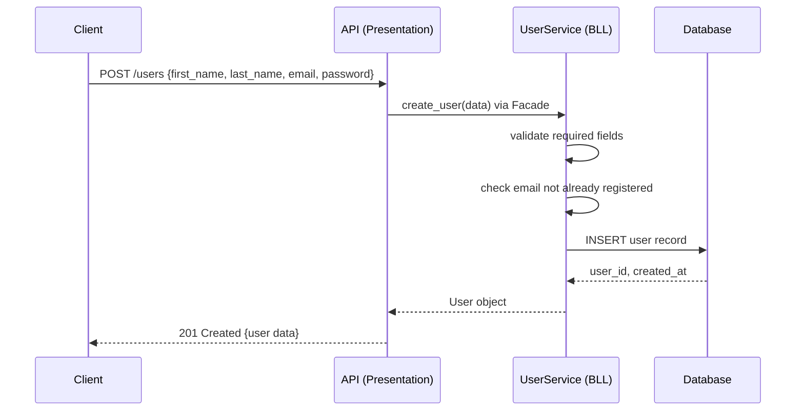
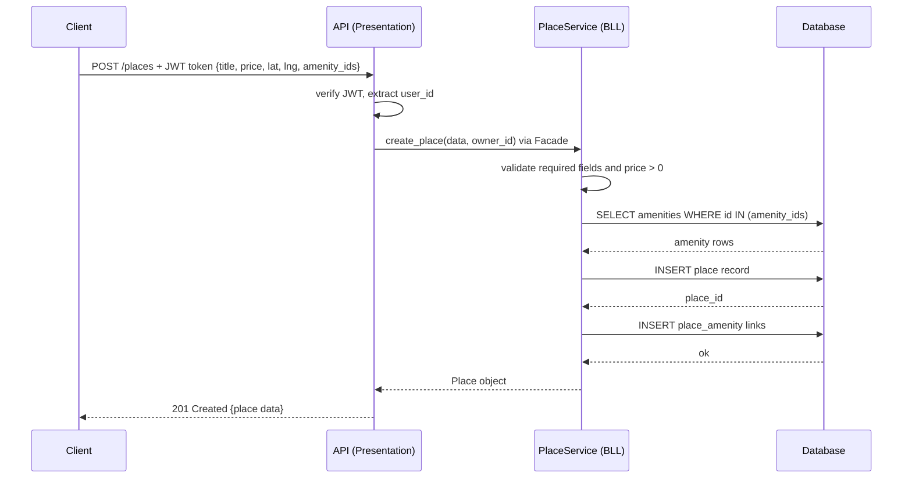
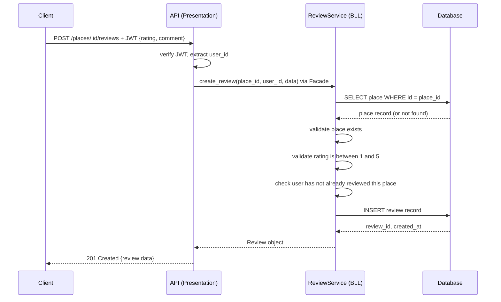
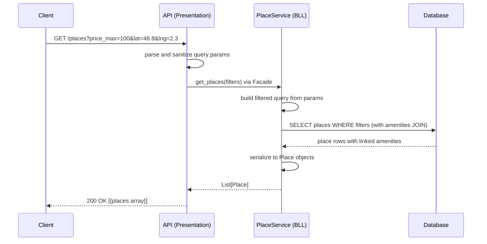

# HBnB Evolution — Part 1: Technical Documentation

## Introduction

HBnB Evolution is a simplified AirBnB-like platform designed using a layered architecture with clear separation of concerns. It allows users to register accounts, list properties, leave reviews, and manage amenities.

This document serves as the complete technical blueprint for the application's architecture and design, compiled before any implementation begins. The goal is to ensure clarity, scalability, and maintainability across all components — and to provide a reference that guides every implementation phase of the project.

It covers the overall system architecture, the design of the core business logic, and the interaction flows for key API operations. All diagrams follow UML notation and are organized by task below.

---

## Table of Contents

- [Task 0 — High-Level Package Diagram](#task-0--high-level-package-diagram)
- [Task 1 — Detailed Class Diagram (Business Logic Layer)](#task-1--detailed-class-diagram-business-logic-layer)
- [Task 2 — Sequence Diagrams for API Calls](#task-2--sequence-diagrams-for-api-calls)
- [Task 3 — Documentation Compilation Notes](#task-3--documentation-compilation-notes)

---

## Task 0 — High-Level Package Diagram

### Purpose

This diagram provides a conceptual overview of the entire application architecture. It shows how the system is divided into three distinct layers and how those layers communicate with each other through the Facade pattern.

### The Three-Layer Architecture

HBnB Evolution is built on a layered architecture where each layer has one clear responsibility and never bypasses another layer to get what it needs.

| Layer | Responsibility |
|---|---|
| **Presentation** | Exposes REST API endpoints, handles incoming requests, validates input, and formats responses |
| **Business Logic** | Contains all core models and enforces every business rule of the application |
| **Persistence** | Handles all data storage and retrieval, abstracting the database from the rest of the app |

### The Facade Pattern

The Facade pattern acts as the communication interface between layers. Instead of layers calling each other's internal methods directly, they go through a simplified interface (the Facade). This means:

- The Presentation layer never touches the database directly
- The Persistence layer never knows about business rules
- Swapping out one layer (e.g. changing the database in Part 3) requires zero changes to the other layers

### Diagram

---

## Task 1 — Detailed Class Diagram (Business Logic Layer)

### Purpose

This diagram shows the internal structure of the Business Logic layer in detail — the four core entities, their attributes, their methods, and the relationships between them.

### BaseModel — The Shared Foundation

All four entities inherit from `BaseModel`. This parent class ensures that every object in the system:
- Has a unique identifier (`UUID4`) generated at creation time
- Automatically records when it was created (`created_at`) and last modified (`updated_at`)
- Exposes standard methods for saving, serializing, and deleting

### Entity Descriptions

**User**
Represents a person using the application. Users can be regular members or administrators (controlled by the `is_admin` flag). They can register, update their profile, own places, and write reviews. The `password` field stores a hashed value — never plain text.

**Place**
Represents a property listed by a user. Each place belongs to exactly one owner (a `User`) and can be associated with multiple amenities. The `latitude` and `longitude` fields enable location-based filtering. Places can be created, updated, deleted, and listed.

**Review**
Represents feedback left by a user about a place they visited. Each review is tied to exactly one `User` and one `Place`, and includes a numeric rating (1–5) and a text comment. A user cannot review the same place twice.

**Amenity**
Represents a feature or facility that a place can offer (e.g. Wi-Fi, parking, pool). Amenities are managed independently and linked to places through a many-to-many relationship — one amenity can belong to many places, and one place can have many amenities.

### Relationships Summary

- `User` owns zero or more `Place` objects (one-to-many)
- `User` writes zero or more `Review` objects (one-to-many)
- `Place` has zero or more `Review` objects (one-to-many)
- `Place` and `Amenity` share a many-to-many relationship

### Diagram

---

## Task 2 — Sequence Diagrams for API Calls

### Purpose

These four diagrams show how a request flows through all three layers of the application for specific API operations. Each diagram captures the step-by-step communication between the Presentation layer (API), the Business Logic layer (BLL), and the Persistence layer (Database).

The general pattern is consistent across all four flows:

> **Client → API** (parse & validate) → **BLL via Facade** (apply business rules) → **Database** (persist or query) → response travels back up to the client

---

### 2.1 — User Registration

**Endpoint:** `POST /users`

**Description:** A new user submits their personal details to create an account. The API forwards the data to the Business Logic layer, which validates the input, checks that the email is not already taken, and persists the new user record. No authentication is required for this operation.

**Key steps:**
1. Client sends registration data
2. API passes data to `UserService` via Facade
3. BLL validates fields and checks for duplicate email
4. BLL instructs the database to insert the new record
5. Success response with the created user data is returned

---

### 2.2 — Place Creation

**Endpoint:** `POST /places`

**Description:** An authenticated user creates a new place listing. The API first verifies the user's JWT token, then passes the listing data to the Business Logic layer. The BLL validates the input, confirms any referenced amenities exist in the database, inserts the place, and links the amenities.

**Key steps:**
1. Client sends place data along with a JWT token
2. API verifies the token and extracts the user's ID
3. BLL validates fields (e.g. price must be positive)
4. BLL checks that all provided amenity IDs exist
5. BLL inserts the place record and creates amenity links
6. Success response with the created place data is returned

---

### 2.3 — Review Submission

**Endpoint:** `POST /places/:id/reviews`

**Description:** An authenticated user submits a review for a specific place. The BLL verifies that the target place exists, validates the rating value, and ensures the user has not already reviewed this place before persisting the new review.

**Key steps:**
1. Client sends review data and JWT token for a specific place
2. API verifies the token and extracts the user's ID
3. BLL fetches the target place to confirm it exists
4. BLL validates the rating (must be between 1 and 5)
5. BLL checks the user has not already reviewed this place
6. BLL inserts the review record
7. Success response with the created review data is returned

---

### 2.4 — Fetching a List of Places

**Endpoint:** `GET /places`

**Description:** A client requests a list of available places, optionally filtered by criteria such as maximum price or location. No authentication is required. The API parses the query parameters, the BLL builds the appropriate query, and the database returns matching results with their linked amenities.

**Key steps:**
1. Client sends a GET request with optional filter parameters
2. API parses and sanitizes the query parameters
3. BLL builds a filtered database query from the parameters
4. Database returns matching place rows with amenities
5. BLL serializes the results into Place objects
6. Success response with the array of places is returned

---

## Task 3 — Documentation Compilation Notes

This section summarizes the key design decisions made throughout this document and explains how each part connects to the overall architecture.

### Design Decisions

**Why a layered architecture?**
Separating the application into three layers (Presentation, Business Logic, Persistence) keeps concerns isolated. Each layer can be developed, tested, and replaced independently. For example, Part 3 of this project will swap the Persistence layer from in-memory storage to a full database without touching the BLL or API.

**Why the Facade pattern?**
The Facade pattern gives each layer a single, clean entry point to the layer below it. Without it, the API could call database methods directly, creating tight coupling that makes the codebase fragile and hard to maintain. With it, each layer only knows about its immediate neighbor.

**Why a shared BaseModel?**
Rather than duplicating `id`, `created_at`, and `updated_at` across all four entities, `BaseModel` centralizes this logic. This guarantees consistent behavior for timestamps and identifiers across the entire application and reduces the risk of bugs from copy-paste errors.

**Why UUID4 for IDs?**
Sequential integer IDs expose information about the database (e.g. how many users exist) and create merge conflicts in distributed systems. UUID4 identifiers are random, globally unique, and safe to generate without a database round-trip.

**Why many-to-many for Place and Amenity?**
An amenity like "Wi-Fi" or "Parking" is not exclusive to one place — many properties share the same amenities. Modeling this as many-to-many avoids duplicating amenity records and makes it easy to filter places by amenity later.

### Document Structure Recap

| Section | Covers | Task |
|---|---|---|
| High-Level Package Diagram | Three-layer architecture + Facade pattern | Task 0 |
| Class Diagram | Entities, attributes, methods, relationships | Task 1 |
| Sequence Diagrams | Four API call flows across all layers | Task 2 |
| Compilation Notes | Design rationale and architecture summary | Task 3 |