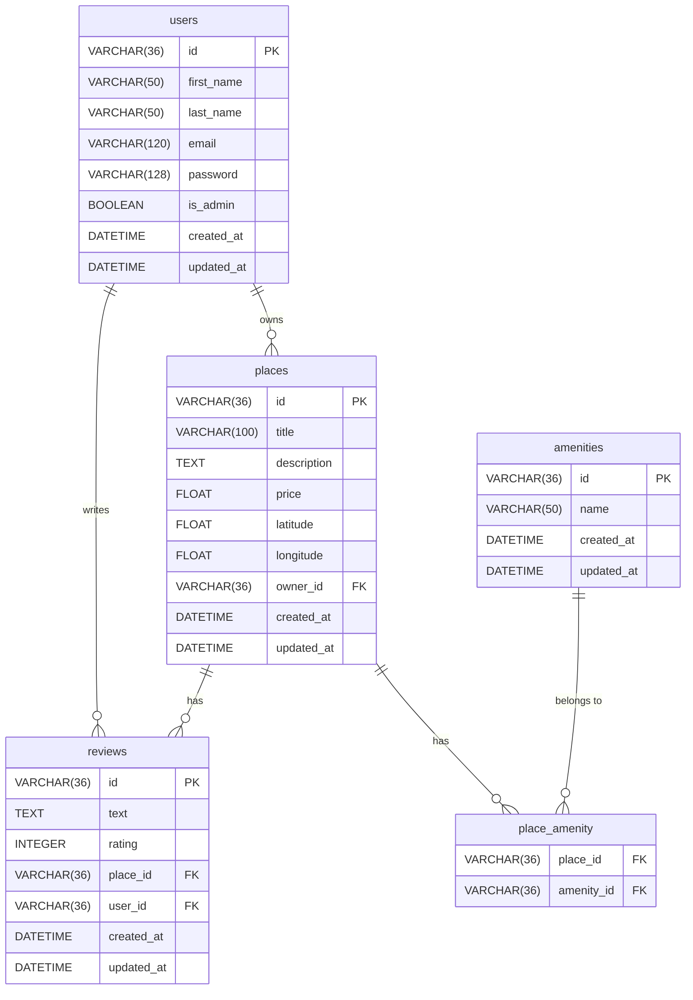

# HBnB Entity-Relationship Diagram

```mermaid
erDiagram
    users {
        VARCHAR(36) id PK
        VARCHAR(50) first_name
        VARCHAR(50) last_name
        VARCHAR(120) email
        VARCHAR(128) password
        BOOLEAN is_admin
        DATETIME created_at
        DATETIME updated_at
    }

    places {
        VARCHAR(36) id PK
        VARCHAR(100) title
        TEXT description
        FLOAT price
        FLOAT latitude
        FLOAT longitude
        VARCHAR(36) owner_id FK
        DATETIME created_at
        DATETIME updated_at
    }

    reviews {
        VARCHAR(36) id PK
        TEXT text
        INTEGER rating
        VARCHAR(36) place_id FK
        VARCHAR(36) user_id FK
        DATETIME created_at
        DATETIME updated_at
    }

    amenities {
        VARCHAR(36) id PK
        VARCHAR(50) name
        DATETIME created_at
        DATETIME updated_at
    }

    place_amenity {
        VARCHAR(36) place_id FK
        VARCHAR(36) amenity_id FK
    }

    users ||--o{ places : "owns"
    users ||--o{ reviews : "writes"
    places ||--o{ reviews : "has"
    places ||--o{ place_amenity : "has"
    amenities ||--o{ place_amenity : "belongs to"
```
